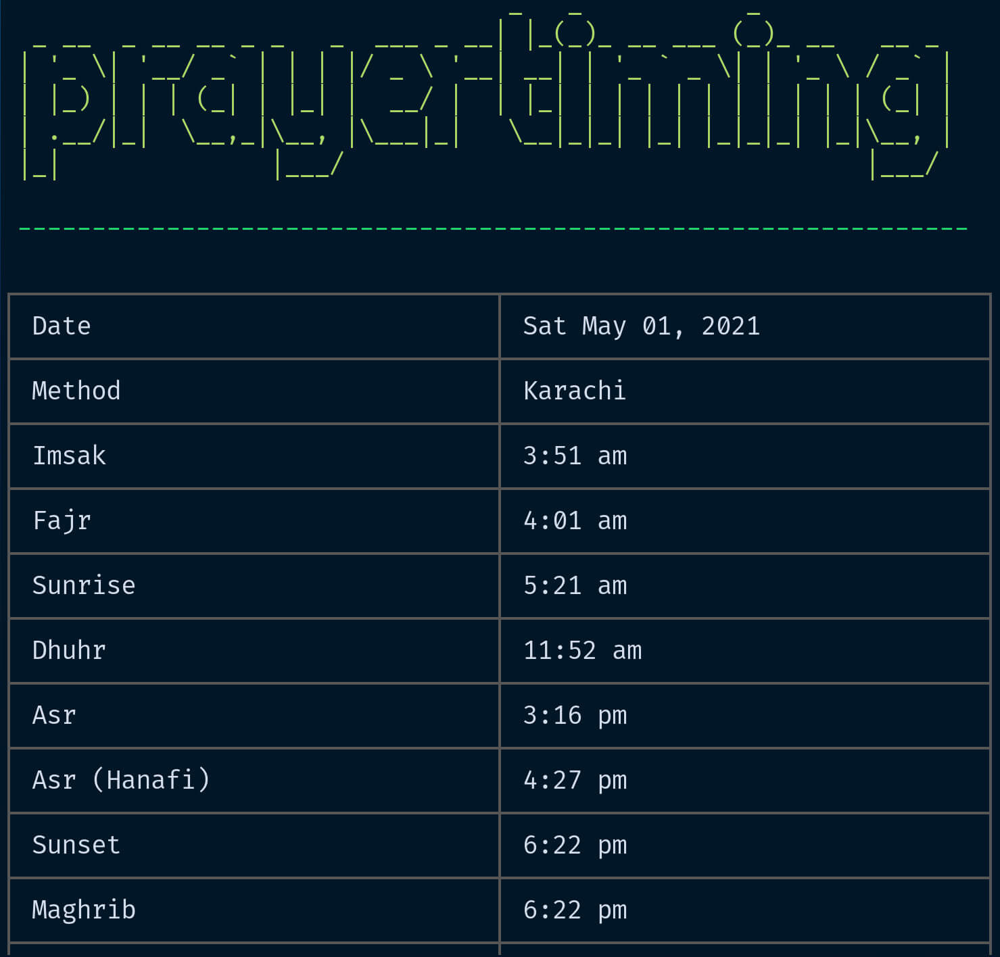
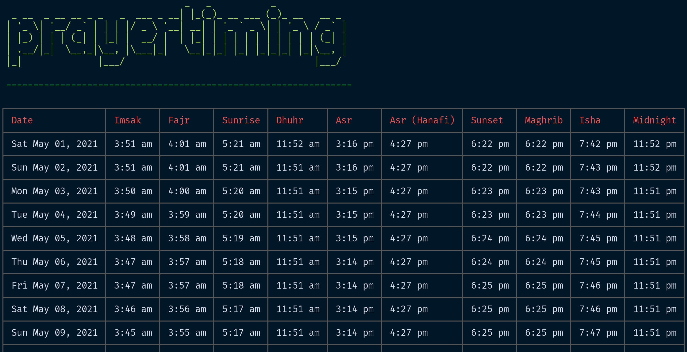

# prayertiming-cli [](https://github.com/sh4hids/prayertiming-cli) · [](https://github.com/sh4hids/prayertiming-cli) · [](https://github.com/sh4hids/prayertiming-cli/issues) · [](https://github.com/sh4hids/prayertiming-cli)

A command line tool to show Muslim prayer times based on coordinates.

### Installation

```bash
$ npm i -g prayertiming-cli
```

### Usage:

```bash
 prayertiming [options]          display prayer times

 prayertiming configure          create new configuration

 prayertiming help               show usage info

 prayertiming showConfig         display current config
```

### Options (optional):

```bash
 --help                          show usage info

 --lat                           latitude

 --long                          longitude

 --method                        calculation method

 --timeFormat                    output time format (12h/24h)

 --type                          output format (daily/monthly)
```

### Alias:

```bash
 pt
```

### Screenshots

- daily



- monthly



### Uninstall

```bash
$ npm uninstall -g prayertiming-cli
```

### Related projects

- [prayertiming](https://github.com/sh4hids/prayertiming)
